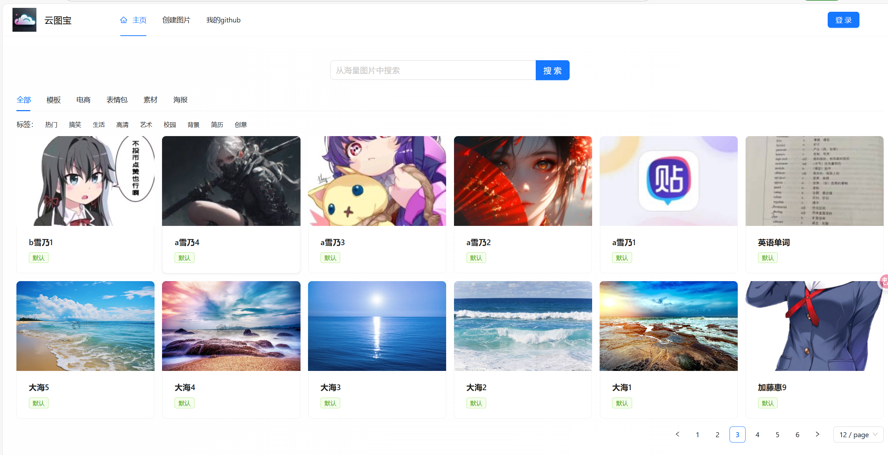

智能云图库项目
项目介绍: 基于 Spring Boot + Redis + Caffeine + COS + AI + WebSocket 的企业级智能协同云图库平台。分为公共图库、私
有图库和团队共享图库三大模块。
主要功能：
- 管理员：
1) 图片上传
2) 图片管理
3) 图片修改
4) 图片审核
5) 图库分析
- 用户：
1) 图片上传
2) 图片下载
3) 图片检索
4) 图片详情
5) 图片分享
- 进阶功能:
1) 以图搜图
2) AI扩图
3) 图片协作编辑

未登录时主页:

项目在线访问地址：http://101.200.240.xx/